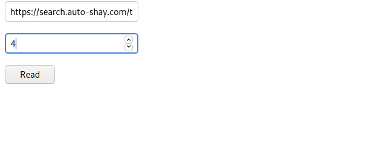
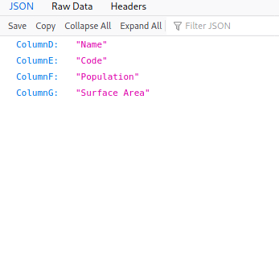
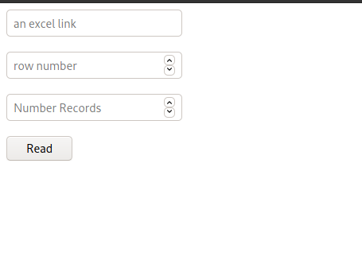
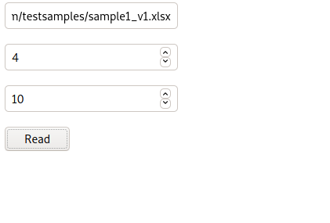
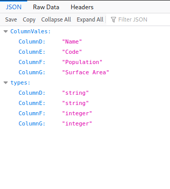

# Task1---readXLSheader

## Python 

- `virtual env`
- `source env/bin/activate`
- `pip install django requests openpyxl`
- `cd task1`
- `python manage.py runserver`

## TASK 1 Output

- after the server started go to [http://localhost:8000/readXLSheader](http://localhost:8000/readXLSheader)

- 

- 

## TASK 2

- waiting

## TASK 3

- after the server started go to [http://localhost:8000/analysisreadXLSheader](http://localhost:8000/analysisreadXLSheader)

- 

- 

- 